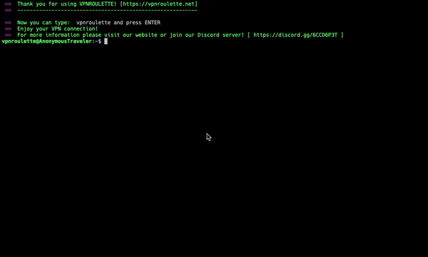

#  **VPNRoulette Client**
 

      
 

VPNRoulette is a service that offers you FREE VPN tunnels all around the globe. It allows you to:

* Watch your favorite TV show (i.e: Dr.Who on the BBC).
* Secure your connection browsing completely anonymous by anonymizing your IP address.
* Connect to insecure game server without worry about security.
* Test whatever you need from another IP address that is not yours.
* Zero-Logs Policy: we don't store any data related to you or your traffic.

There are some cool features coming soon.
Stay tuned!
https://vpnroulette.net

----
| Version | Release | Date |
| ------- | --------|---------- |
| Alpha 1 | 0.0.4 | 2020-05-31 |
| Alpha 2 | 0.2.0 | 2020-09-21 |
| Beta 1  | 0.3.7 | 2021-02-02 |

----

## ***List of contents***  
1. [Usage](#usage)  
2. [Client Installation](#client-installation)  
    2.1. [Linux](#debian-based-distributions)  
        2.1.1. [Debian Based Distributions](#debian-based-distributions)  
        2.1.2. [RedHat Based Distributions](#redhat-based-distributions)  
    2.2. [Mac OS](#mac)  
    2.3. [Raspbian (Raspberry Pi 3/4)](#raspi34)  
    2.4. [Windows](#windows)  
    2.5. [Want to Know More?](#want-to-know-more)  

## ***Usage***
This is the CLI version for Linux, Mac & Windows OS.
Soon a client for Mobile platforms will be available.

1. Open a terminal and type:
`vpnroulette`

   
  

That's it! You will be automatically prompted for access credentials.  

TIP: Hit ENTER in username and password questions if you don't have a user account in vpnroulette.net)

## ***Client installation***

### ***Linux***  
#### ***Debian based distributions***

  * Open a terminal window and type:

    ` curl -s https://raw.githubusercontent.com/vpnroulette/client-linux/main/utils/installer-debian.sh | sudo bash `

    This will check for some dependencies like openvpn client and some other tools like jq, curl, ... and install vpnroulette in your system.

#### ***RedHat based distributions***

[in progress]

### ***Mac***

   * Open a terminal and type:

    `curl -s "https://raw.githubusercontent.com/vpnroulette/client-linux/main/utils/installer-mac.sh" |bash -`

### ***Raspi3/4***

    [in progress]

### ***Windows***

   * Coming soon...

## ***Want to know more?***

Join our community and discover how to become a node and build an unstoppable VPN network all around the world.

* **Website:** https://vpnroulette.com
* **Discord server:** https://discord.gg/6CCD6P3T  
